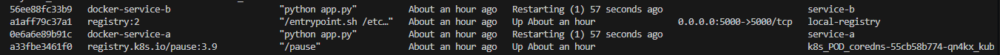

Approovia

# Approovia

## OVERVIEW

The project has 3 stages:

Design & Planning (Toolchain and workflow design)

Hands-on Technical Work (VMs, WireGuard, Docker, CI/CD, HAProxy, Monitoring)

Documentation + Pairing Prep

## INSTALLATION

STAGE 1: Design & Planning (Deliverable = a Design Document)

📌 Goal

Provide a toolchain & workflow from product ideation → deployment for a cloud-agnostic, OSS-based setup.

🔹 Step 1.1: Design the Toolchain

Here’s a proposed OSS-focused toolchain:

Phase / Tool(s) / Purpose

Product Design / Draw.io, Figma, Notion, Obsidian / Sketches, storyboards, product notes

User Stories, Specs / Jira OSS alternative → Plane.so, Taiga, Notion / Epics, stories, spec tracking

Architecture / Diagrams.net, Excalidraw, Markdown / Diagrams (draw.io), RFC docs

Source Control / Git + Gitea / GitLab CE / Source repo

CI/CD / GitLab CI, Drone CI, or Jenkins / Test → Build → Deploy

Testing / pytest (Python), Go test (Go) / Unit testing

Packaging / Docker, BuildKit / Containerization

Container Registry / Harbor (local) / Store or pull images

Secrets Management / Vault, Sealed Secrets, or GitLab Secrets / Secure variables

Deployment / Ansible, Shell Scripts / Orchestrate deployments

Monitoring / Prometheus + Grafana, Alertmanager / Observability

Logging Loki / ELK Stack / Logs aggregation

Hosting / Cloud-agnostic (e.g., VMs, bare-metal, KVM, Proxmox) / Vendor neutral setup

🔹 Step 1.2: Design Simple Workflow for Each Stage

For each phase, describe the flow with a simple diagram + bullet points:

Sketch in draw.io or on paper and include a picture in your repo.

Example for CI/CD:

Dev Pushes Code ➜ GitLab CI Runner ➜ Run Tests ➜ Build Docker Image ➜ Push to Harbor ➜ SSH to VMs ➜ Pull & Restart Containers

[DRAW.IO](architecture.drawio)

🔹 Step 1.3: Alternative Hosting Environment Suggestion

Propose a vendor-neutral option like:

To meet Approovia's requirement for a cloud-agnostic, open-source infrastructure, I propose a fully self-hosted,

vendor-neutral environment using Proxmox VE and KVM, with an optional migration path to Kubernetes (k3s).

Option 1: Local Setup Using Proxmox VE

Proxmox VE is a powerful, open-source virtualization platform based on KVM + LXC + Debian, ideal for DevOps and testing

production-like environments locally or on bare metal.

💡 Advantages:

Fully open-source and self-hosted

Simple web GUI to manage VMs and containers

Supports clustering, live migration, and high availability (HA)

Built-in support for ISO storage, backups, firewalling, and monitoring

⚙️ Stack Setup:

Layer Tool

Virtualization Proxmox VE (KVM backend)

Guest OS Ubuntu Server 22.04 VMs

Networking Linux bridges, VLANs, WireGuard

Container Runtime Docker

CI/CD GitLab CE or Drone

Monitoring Prometheus + Grafana

Registry Local Harbor or GitLab Container Registry

📦 Use Case:

Provision 3 VMs for the test setup

Self-hosted apps, GitLab, HAProxy, Prometheus stack

Portability across data centers, laptops, and colo servers

🖥️ Option 2: Bare-metal with MAAS or PXE

For large-scale or remote environments:

MAAS (Metal as a Service) enables full automation of physical server provisioning via PXE boot.

⚙️ Stack:

MAAS handles imaging, DNS, DHCP, PXE, IPMI boot

Deploy VMs or OS images (Ubuntu/CentOS)

Ideal for edge, on-prem, or regulated workloads

🛠️ Option 3: Manual Vagrant Setup

For portability and developer reproducibility:

Use Vagrant + VirtualBox or Vagrant + libvirt/KVM to:

Define VMs as code (Vagrantfile)

Automate provisioning scripts

Simulate full networking and deployment pipelines

🚀 Bonus: Kubernetes Migration Path via k3s

To scale or modernize the stack, migration to Kubernetes can follow.

Why k3s?

Lightweight, production-grade Kubernetes distro by Rancher

Great for edge, testing, and constrained environments

Simple single-binary install

🔄 Migration Plan:

Component Legacy Kubernetes

App Deployment Docker CLI / Shell kubectl, Helm

Reverse Proxy HAProxy Ingress Controller (e.g., NGINX)

CI/CD GitLab CI GitLab CI or Argo CD

Monitoring Prometheus + Grafana Prometheus Operator

Registry Harbor Harbor

🔧 Migration Steps:

Install k3s on 3 nodes

Containerize the apps as Kubernetes Deployments

Migrate HAProxy config into Kubernetes Ingress

Use Helm to deploy Prometheus, Grafana

Replace SSH-based deploy with GitOps (e.g., Argo CD)

📌 Summary

Option Description Best Use

Proxmox VE Full virtualization with GUI On-prem labs, home DC

MAAS Bare-metal provisioning Colo, regulated environments

Vagrant Lightweight local dev setup Developer laptops

k3s Kubernetes migration path Scalable & modern architecture

## STAGE 2: Hands-on Technical Implementation

✅ STAGE 2: Hands-on Technical Implementation

🔹 Step 2.1: VM & WireGuard Setup

Plan:

Create 3 Ubuntu 22.04 VMs using:

Vagrant (easiest locally)

or Docker-in-Docker

or a cloud VPS if available

WireGuard Tasks:

Install WireGuard on all 3

Create peer configs (e.g., /etc/wireguard/wg0.conf)

Enable systemd service for persistence:

    sudo systemctl enable wg-quick@wg0

📁 /stage2/wireguard/

Each peer’s wg0.conf

Network diagram 

stage2/
└── docker/
    ├── service-a/
    │   ├── app.py
    │   ├── Dockerfile
    ├── service-b/
    │   ├── app.py
    │   ├── Dockerfile
    ├── build.sh
    ├── push.sh
    └── deploy.sh

🔹 Step 2.2: Docker Deployment

Languages:

Write minimal apps in Python or Go:

Service A: "Hello from A"

Service B: "Hello from B"

Dockerfile (multi-stage, non-root)

Example: Use alpine, USER app, CMD [...]

Shell scripts:

build.sh: Build image

push.sh: Push to registry

deploy.sh: SSH to VMs and run containers

📁 Deliverables: /stage2/docker/

Dockerfile, build.sh, push.sh, deploy.sh

Mention the local registry used (e.g., localhost:5000)

🔹 Step 2.3: HAProxy Reverse Proxy

Tasks:

Install HAProxy on VM1

Add routes for:

/service-a ➜ Service A container

/service-b ➜ Service B container

Add optional:

ACLs

Health checks

SSL (self-signed or Let's Encrypt steps)

📁 Deliverables: /stage2/haproxy/haproxy.cfg

haproxy.cfg

curl screenshots or command outputs

🔹 Step 2.4: CI/CD Pipeline

Choose one:

GitLab CE (via Docker)

Drone CI (lightweight)

Jenkins (heavier)

Pipeline file:

    .gitlab-ci.yml
    
        stages:
            
            - test
            
            - build
            
            - push
            
            - deploy

            variables:
            
            IMAGE_NAME: "localhost:5000/service"
            
            SSH_USER: "ubuntu"
           
            NODE_1: "10.0.0.11"
           
            NODE_2: "10.0.0.12"
           
            NODE_3: "10.0.0.13"
           
            DEPLOY_SCRIPT: "./deploy.sh"

            # =============================
           
            # 1. Run Unit Tests
           
            # =============================
           
            test:
           
            stage: test
           
            image: python:3.11-slim
           
            script:
           
                - pip install -r requirements.txt
           
                - pytest tests/

            # =============================
           
            # 2. Build Docker Image
           
            # =============================
           
            build:
           
            stage: build
           
            script:
           
                - docker build -t $IMAGE_NAME-a:latest ./service-a
           
                - docker build -t $IMAGE_NAME-b:latest ./service-b

            # =============================
           
            # 3. Push to Local Registry
           
            # =============================
           
            push:
           
            stage: push
           
            script:
           
                - docker push $IMAGE_NAME-a:latest
           
                - docker push $IMAGE_NAME-b:latest

            # =============================

            # 4. SSH into Nodes & Deploy

            # =============================

            deploy:

            stage: deploy

            script:

                - chmod +x $DEPLOY_SCRIPT

                - ssh $SSH_USER@$NODE_1 "$DEPLOY_SCRIPT $IMAGE_NAME-a service-a"

                - ssh $SSH_USER@$NODE_2 "$DEPLOY_SCRIPT $IMAGE_NAME-b service-b"

                - ssh $SSH_USER@$NODE_3 "$DEPLOY_SCRIPT $IMAGE_NAME-a service-a && $DEPLOY_SCRIPT $IMAGE_NAME-b service-b"

                
    Deploy.sh for above .gitlab-ci.yml :

            #!/bin/bash
            
            IMAGE_NAME=$1
            
            SERVICE_NAME=$2

            echo "Deploying $SERVICE_NAME from $IMAGE_NAME..."

            docker pull $IMAGE_NAME:latest

            docker stop $SERVICE_NAME || true
            
            docker rm $SERVICE_NAME || true

            docker run -d \
            
            --name $SERVICE_NAME \
            
            -p 80:80 \
            
            --restart always \
            
            $IMAGE_NAME:latest

    
     or .drone.yml

            kind: pipeline
            
            type: docker
            
            name: default

            steps:
            
            - name: test
            
                image: python:3.11
            
                commands:
            
                - pip install -r requirements.txt
            
                - pytest tests/

            
            - name: build
            
                image: docker:dind
            
                volumes:
            
                - name: dockersock
            
                    path: /var/run/docker.sock
            
                commands:
            
                - docker build -t localhost:5000/service-a ./service-a
            
                - docker build -t localhost:5000/service-b ./service-b

            
            - name: push
            
                image: docker:dind
            
                volumes:
            
                - name: dockersock
            
                    path: /var/run/docker.sock
            
                commands:
            
                - docker push localhost:5000/service-a
            
                - docker push localhost:5000/service-b

            - name: deploy

                image: alpine:latest

                environment:

                SSH_KEY:

                    from_secret: ssh_key

                commands:

                - apk add --no-cache openssh

                - mkdir -p ~/.ssh

                - echo "$SSH_KEY" > ~/.ssh/id_rsa

                - chmod 600 ~/.ssh/id_rsa

                - ssh-keyscan 10.0.0.XX >> ~/.ssh/known_hosts

                - ssh-keyscan 10.0.0.XX >> ~/.ssh/known_hosts

                - ssh ubuntu@10.0.0.XX './deploy.sh localhost:5000/service-a service-a'

                - ssh ubuntu@10.0.0.XX './deploy.sh localhost:5000/service-b service-b'

            volumes:

            - name: dockersock

                host:

                path: /var/run/docker.sock

Tasks in pipeline:

    Run unit tests

    Build image

    Push to registry

    SSH into VMs and deploy

Bonus: Describe secrets management:

    GitLab secrets

    Drone secrets

    Vault integration

📁 Deliverables:

    CI config file

  

🔹 Step 2.5: Monitoring & Alerts

Using Docker containers:

    Spin up:

        Prometheus

        Grafana

    Scrape Docker metrics via cAdvisor or node-exporter

Create alert:

    Trigger if container restarts > n in 10 min

📁 Deliverables:

    Prometheus config

    Screenshot of Grafana dashboard + alert config

    Folder Structure (GitHub)

            approovia-devops/
        ├── README.md
        ├── stage1/
        │   ├── toolchain.md
        │   ├── architecture.drawio
        │   └── workflows.png
        ├── stage2/
        │   ├── wireguard/
        │   │   ├── wg0.conf (x3)
        │   ├── docker/
        │   │   ├── service-a/
        │   │   ├── service-b/
        │   │   ├── build.sh
        │   │   └── deploy.sh
        │   ├── haproxy/
        │   │   └── haproxy.cfg
        │   ├── cicd/
        │   │   └── .gitlab-ci.yml
        │   └── monitoring/
        │       └── prometheus.yml
        └── docs/
            ├── assumptions.md
            ├── troubleshooting.md
            └── architecture.png

